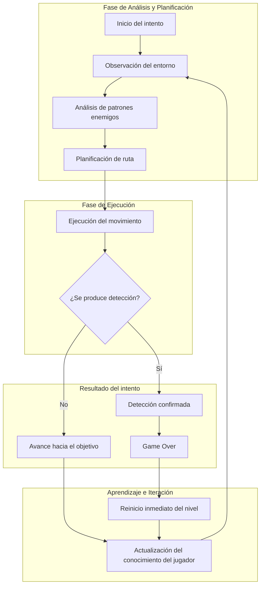
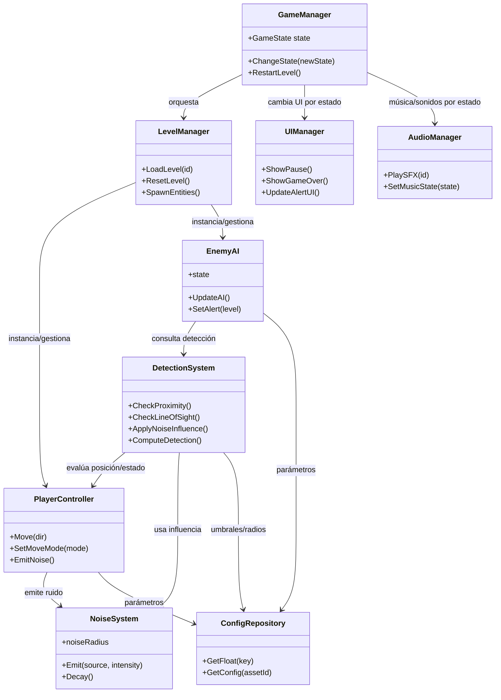
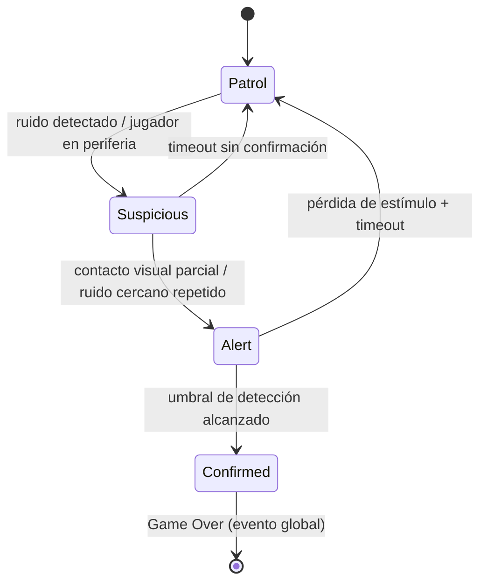
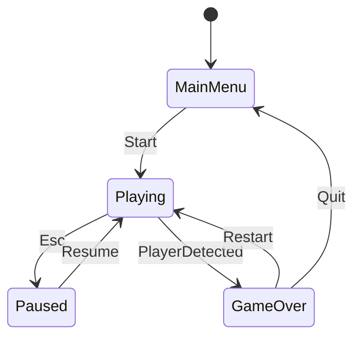

# Diseño de Juego (GDD) — Threshold of Silence:

## I. FICHA TÉCNICA Y CONCEPTO
### Sección: High Concept

### Título del Proyecto
**Threshold of Silence**

### Género

- **Género principal:** Top-Down 2D / Acción – Sigilo  
- **Género secundario:** Infiltración táctica de ritmo rápido  
- **Modo de juego:** Un jugador (single-player)  

**Mecánicas centrales:**
- Desplazamiento estratégico en vista superior  
- Sistema de detección compuesto (radio, línea de visión y ruido)  
- Penalización inmediata ante detección (*Game Over*)  
- Reintento rápido orientado al aprendizaje por iteración  

### Plataforma Objetivo

- **Plataforma primaria:** PC (Windows / Linux)  
- **Dispositivos de entrada:**  
  - Teclado y mouse (principal)  
  - Mando (opcional)  
- **Formato de visualización:**  
  - Relación de aspecto 16:9  
  - Soporte para modo ventana y pantalla completa  

La elección de PC como plataforma principal responde a criterios de accesibilidad, facilidad de evaluación académica y viabilidad para pruebas iterativas y distribución del prototipo.

### Motor Propuesto

- **Motor principal:** Unity  
  - Entorno robusto para desarrollo 2D  
  - Amplia documentación y soporte académico  
  - Adecuado para modelar sistemas de sigilo, estados y detección  

- **Alternativa viable:** Godot Engine  
  - Enfoque open-source  
  - Arquitectura modular  
  - Bajo consumo de recursos  

La selección final del motor se justifica en función de la facilidad para implementar sistemas de detección, control de estados y separación de responsabilidades a nivel de arquitectura de software.

### Público Objetivo (Target Audience)

- **Edad sugerida:** 14+  
- **Género:** Sin restricción  

**Perfil psicográfico:**
- Jugadores que disfrutan experiencias de alta tensión y presión constante  
- Usuarios familiarizados con juegos de acción top-down y sigilo  
- Interés por mecánicas punitivas que recompensan la planificación y la ejecución precisa  

**Audiencia secundaria:**
- Jugadores que prefieren retos breves estructurados en escenarios o misiones  
- Usuarios interesados en sistemas de inteligencia artificial simples pero legibles, basados en patrones de patrullaje y detección  

### Sinopsis / Elevator Pitch

*Threshold of Silence* es un videojuego Top-Down 2D de acción y sigilo en el que el jugador debe infiltrarse en escenarios cerrados para completar objetivos de extracción, evitando la detección enemiga mediante el control preciso del movimiento, la gestión del ruido y la lectura de la línea de visión. La detección activa de forma inmediata una condición de fallo, transformando cada intento en un ejercicio de planificación táctica, ejecución cuidadosa y mejora progresiva a través de la iteración.

**Referencia conceptual (X meets Y):**  
*Hotline Miami* × *Metal Gear Solid* — ritmo rápido con reglas estrictas de sigilo y detección legible.

### Unique Selling Points (USP)

1. **Detección compuesta y legible:**  
   La detección no depende de un único chequeo; combina radio, línea de visión y ruido con retroalimentación clara que permite inferir causa y corrección.

2. **Economía de riesgo basada en parámetros:**  
   El jugador gestiona el riesgo mediante variables controlables (distancia, visibilidad y nivel de ruido), permitiendo balanceo cuantitativo del desafío.

3. **Iteración rápida orientada al dominio del sistema:**  
   El reinicio inmediato y las condiciones de fallo deterministas convierten el progreso en aprendizaje medible y no en acumulación de recursos.

---

## II. ANÁLISIS MDA (MECHANICS – DYNAMICS – AESTHETICS)
### El núcleo del diseño

El diseño de *Threshold of Silence* se fundamenta en el framework MDA (Mechanics, Dynamics, Aesthetics), el cual permite analizar y justificar la experiencia del jugador desde las reglas formales del sistema hasta las emociones que emergen durante la interacción. Este enfoque garantiza coherencia entre el diseño técnico, el comportamiento del juego y la respuesta emocional esperada.

### 2.1 Aesthetics – La experiencia del jugador

La experiencia está orientada a generar un estado constante de alerta y tensión, donde cada acción tiene consecuencias inmediatas.

**Emociones principales buscadas:**
- **Tensión constante:** Exposición permanente al riesgo de detección.  
- **Presión psicológica:** Fallo inmediato como refuerzo de decisiones conscientes.  
- **Reto y superación:** Aprendizaje por repetición sin castigo acumulativo.  
- **Satisfacción por ejecución limpia:** Dominio progresivo del sistema.  

Estas emociones posicionan al jugador en un rol estratégico, donde observar, anticipar y ejecutar con precisión resulta más relevante que reaccionar de forma impulsiva.

### 2.2 Dynamics – Comportamientos emergentes

Las dinámicas emergen de la interacción entre el sistema de detección, el diseño espacial del nivel y la penalización asociada al ruido y la proximidad.

| Mecánicas involucradas                | Interacción del sistema                                      | Dinámica emergente                                    | Experiencia generada            |
| ------------------------------------- | ------------------------------------------------------------ | ----------------------------------------------------- | ------------------------------- |
| Detección por radio + línea de visión | El enemigo monitorea áreas activas                            | Evitar zonas abiertas y usar coberturas               | Tensión y cautela               |
| Ruido por movimiento                  | Mayor velocidad incrementa riesgo                             | Regulación consciente del desplazamiento              | Decisiones tácticas             |
| Game Over inmediato                   | No existe margen de error tras la detección                  | Planificación previa                                  | Presión y enfoque               |
| Reintento rápido                      | El fallo no interrumpe el flujo                               | Aprendizaje por iteración                             | Superación y dominio            |
| Patrullaje predecible                 | Rutas y tiempos consistentes                                 | Observación y memorización del entorno                | Control progresivo              |

### 2.3 Mechanics – Reglas y sistemas formales

Las mecánicas constituyen las reglas explícitas que gobiernan el funcionamiento del juego y se definen de forma clara y medible.

**Mecánicas base del sistema:**

- **Movimiento del jugador:**  
  - Vista superior, 8 direcciones.  
  - Dos modos de desplazamiento:
    - **Movimiento normal:** 3.5 u/s  
    - **Movimiento preciso (sigilo):** 2.0 u/s  

- **Sistema de detección enemiga:**  
  - **Radio base:** 4.0 u  
  - **Cono de visión:** 60° / distancia 6.0 u  
  - **Umbral de detección:** 100 puntos acumulativos  

- **Generación de ruido:**  
  - Movimiento normal: +1.5 u al radio de escucha  
  - Movimiento preciso: +0.5 u al radio de escucha  

- **Condición de fallo:**  
  - Detección confirmada activa *Game Over* inmediato.  

- **Reinicio:**  
  - Reinicio instantáneo sin penalización persistente.  

Estas reglas conforman un sistema cerrado, determinista y parametrizable, diseñado para facilitar el balanceo y la validación temprana del diseño.

### Relación MDA y coherencia del diseño

En *Threshold of Silence*, el modelo MDA se adopta como un marco de validación desde una perspectiva de ingeniería, asegurando trazabilidad directa entre reglas del sistema, comportamientos emergentes y experiencia del jugador. La experiencia estética resulta del dominio progresivo de parámetros cuantificables, permitiendo evaluar el equilibrio del diseño mediante ajustes controlados antes de la implementación.

---

## III. MECÁNICAS DETALLADAS (GAME SYSTEM DESIGN)

Esta sección describe en detalle los sistemas que componen el funcionamiento interno de *Threshold of Silence*. El objetivo es especificar las mecánicas de forma formal y verificable, definiendo reglas, estados y relaciones entre sistemas que permitan analizar, balancear y validar el diseño antes de cualquier implementación técnica.

Cada sistema se concibe como un subsistema independiente pero interconectado, siguiendo principios de diseño modular y separación de responsabilidades.

### 3.1 Core Loop del Juego

El Core Loop define el ciclo principal de interacción que el jugador repetirá de manera constante durante la experiencia. En *Threshold of Silence*, este bucle está diseñado para ser corto, punitivo y orientado al aprendizaje iterativo.

**Descripción del ciclo principal:**

1. **Observación del entorno**  
   El jugador analiza el escenario, identifica rutas posibles, zonas de riesgo y patrones de patrullaje enemigos.

2. **Planificación de ruta**  
   Se selecciona una trayectoria considerando cobertura, distancia a enemigos, ruido potencial y tiempos de exposición.

3. **Ejecución del movimiento**  
   El jugador se desplaza gestionando velocidad, precisión y posicionamiento espacial.

4. **Evaluación del resultado**  
   - Avance exitoso hacia el objetivo.  
   - Incremento del estado de alerta enemigo.  
   - Detección confirmada y activación de *Game Over*.  

5. **Reintento inmediato o progresión**  
   El jugador reinicia el nivel o continúa hacia el siguiente objetivo aplicando el conocimiento adquirido.

Este bucle refuerza un flujo de juego basado en prueba, error y optimización del comportamiento del jugador.

**Diagrama del Core Loop**

### 3.2 Sistema de Movimiento

El sistema de movimiento constituye la base de interacción del jugador con el entorno y es responsable de la precisión y legibilidad de la experiencia.

**Características principales:**
- Desplazamiento en vista superior con movimiento en ocho direcciones.
- Movimiento continuo y determinista, sin aceleración ni inercia compleja.
- Prioridad en la respuesta inmediata a los inputs del jugador.

**Modos de desplazamiento:**
- **Movimiento normal:**  
  - Velocidad base: 3.5 unidades/segundo.
  - Genera un nivel estándar de ruido.
- **SIGILO (Movimiento preciso):**  
  - Velocidad reducida: 2.0 unidades/segundo.
  - Genera menor nivel de ruido, favoreciendo la infiltración.

**Restricciones de diseño:**
- No se incluyen mecánicas reactivas como dash, rodar o salto.
- El diseño privilegia la planificación previa sobre la reacción instantánea.
- El movimiento está limitado por colisiones sólidas del entorno.

### 3.3 Sistema de Detección Enemiga

El sistema de detección es el núcleo del diseño de sigilo y define cuándo y cómo el jugador es descubierto.

La detección se basa en la combinación de tres factores principales:

- **Proximidad**
- **Línea de visión**
- **Ruido**

Estos factores operan de forma conjunta y alimentan un sistema progresivo de estados de alerta.

#### 3.3.1 Detección por proximidad

- Cada enemigo posee un radio de detección base configurable (ejemplo inicial: 4.0 unidades).
- Si el jugador ingresa en este radio, el enemigo comienza a incrementar su estado de alerta.
- El radio efectivo puede ampliarse temporalmente por efectos de ruido.

#### 3.3.2 Detección por línea de visión

- Los enemigos cuentan con un cono de visión orientado según su dirección de patrullaje.
- Parámetros iniciales:
  - Ángulo del cono: 60°
  - Distancia máxima: 6.0 unidades
- La detección solo ocurre si no existen obstáculos sólidos entre el enemigo y el jugador.
- La línea de visión tiene prioridad sobre otros métodos de detección.

#### 3.3.3 Estados de alerta

El sistema de detección no es binario, sino progresivo. Los enemigos transitan por los siguientes estados:

- **Patrullaje:** Estado base, sin conocimiento del jugador.
- **Alerta parcial:** El enemigo sospecha de la presencia del jugador.
- **Detección confirmada:** El jugador ha sido identificado con certeza.

La transición entre estados depende de umbrales configurables asociados a tiempo de exposición, distancia y nivel de ruido.

### 3.4 Sistema de Ruido

El sistema de ruido introduce una variable de riesgo indirecta asociada al movimiento del jugador.

**Reglas principales:**
- El movimiento genera ruido de forma proporcional a la velocidad.
- El ruido se propaga dentro de un radio determinado.
- Los enemigos dentro de este radio incrementan su estado de alerta.

**Valores iniciales de referencia:**
- Movimiento normal: +1.5 unidades al radio de escucha.
- Movimiento preciso: +0.5 unidades al radio de escucha.

El ruido no provoca detección inmediata, pero acelera la transición entre estados de alerta.

### 3.5 Sistema de Condición de Fallo (Game Over)

La condición de fallo está diseñada para ser clara, inmediata y determinista.

**Regla principal:**
- Cuando el estado de alerta de un enemigo alcanza el umbral máximo, se activa automáticamente el estado de *Game Over*.

**Principios de diseño:**
- No existe combate ni fase de persecución prolongada.
- El fallo es consecuencia directa de una decisión o error del jugador.
- Se elimina cualquier ambigüedad sobre la causa del fallo.

### 3.6 Sistema de Reinicio y Reintento

Tras un *Game Over*, el sistema permite reiniciar el nivel de forma inmediata.

**Características:**
- Reinicio rápido sin tiempos de espera extensos.
- Restauración determinista del estado inicial del nivel.
- No existen penalizaciones persistentes entre intentos.

Este sistema mantiene al jugador dentro del Core Loop y refuerza el aprendizaje por iteración.

### 3.7 Alcance del Slice Funcional

Para efectos del prototipo evaluable, el alcance funcional se limita a los siguientes sistemas:

**Incluido:**
- Movimiento del jugador.
- Sistema de detección enemiga.
- Patrullaje básico de enemigos.
- Feedback visual y sonoro asociado a detección.
- Condición de *Game Over*.
- Reinicio inmediato del nivel.

**Excluido explícitamente:**
- Sistemas de combate.
- Inventario o gestión de ítems.
- Puntuación numérica.
- Progresión persistente.
- Guardado de partida.

La delimitación del alcance permite centrar el diseño en la validación del sigilo como mecánica central.

### 3.8 Controles y Mapeo de Inputs

El esquema de control está diseñado para ser minimalista y coherente con la naturaleza táctica del juego.

| Acción del jugador        | Input asignado |
|---------------------------|----------------|
| Movimiento                | WASD           |
| SIGILO (Movimiento preciso) | Shift          |
| Acción contextual         | E              |
| Reinicio rápido del nivel | R              |
| Pausa / Menú              | Esc            |

**Nota de HUD:** Cuando `Shift` está activo, el HUD muestra la etiqueta "SIGILO (Movimiento preciso)" para reforzar el estado del modo de movimiento.

**Consideraciones de diseño:**
- No se utilizan combinaciones complejas de teclas.
- La prioridad es la precisión y la respuesta inmediata.
- El esquema es compatible con remapeo para mando.

### Relación con el análisis MDA

Las mecánicas descritas en esta sección materializan de forma directa las dinámicas y experiencias definidas en el análisis MDA. Cada sistema ha sido diseñado para ser parametrizable, permitiendo ajustes controlados durante el balanceo sin comprometer la coherencia global del diseño.

---

## IV. NARRATIVA Y MUNDO (WORLDBUILDING)

### 4.1 Sinopsis General

*Threshold of Silence* sitúa al jugador en instalaciones cerradas y altamente controladas, diseñadas para restringir el movimiento, limitar la información disponible y penalizar cualquier error de ejecución. El jugador asume el rol de un agente anónimo cuya misión consiste en infiltrarse, desplazarse sin ser detectado y alcanzar puntos de extracción definidos.

El mundo del juego no se presenta de forma explícita mediante diálogos extensos o cinemáticas, sino a través del espacio, la disposición de los enemigos y las restricciones impuestas por el entorno. La narrativa se construye de manera implícita, permitiendo que el jugador infiera el contexto a partir de la arquitectura de los niveles y de las reglas que gobiernan el sistema.

Este enfoque narrativo reduce la dependencia de recursos narrativos tradicionales y refuerza la lectura sistémica del juego.

### 4.2 Enfoque Narrativo

El enfoque narrativo es deliberadamente minimalista y funcional. No existe una progresión narrativa clásica basada en actos o guion lineal; en su lugar, el relato emerge de la repetición, el error y la mejora progresiva del desempeño del jugador.

**Principios narrativos adoptados:**

- **Narrativa ambiental:**  
  El contexto se comunica mediante el diseño de niveles, iluminación, distribución espacial y comportamiento enemigo.
- **Ambigüedad deliberada:**  
  La ausencia de información explícita incrementa la sensación de vulnerabilidad e incertidumbre.
- **Jugador como agente silencioso:**  
  El protagonista carece de identidad definida, facilitando la proyección del jugador sobre la experiencia.
- **Narrativa emergente por iteración:**  
  Cada intento fallido forma parte del relato implícito del jugador dentro del sistema.

Este enfoque evita la sobrecarga narrativa y mantiene coherencia con un diseño centrado en reglas claras, consecuencias inmediatas y aprendizaje iterativo.

### 4.3 Mundo de Juego

El mundo de *Threshold of Silence* se compone de escenarios cerrados, controlados y funcionales, concebidos como espacios de prueba para el sistema de sigilo más que como entornos narrativos extensos.

**Características estructurales del mundo:**

- Espacios interiores con visibilidad limitada.
- Rutas múltiples con distintos niveles de riesgo.
- Zonas abiertas que incrementan la exposición del jugador.
- Áreas de cobertura que favorecen la observación y la planificación.
- Distribución intencional de enemigos para inducir decisiones tácticas.

El mundo actúa como un sistema hostil y determinista que no se adapta al jugador; es el jugador quien debe adaptarse al sistema.

**Relación mundo–jugabilidad:**

| Elemento del entorno        | Función narrativa implícita        | Impacto en el gameplay              |
|----------------------------|-----------------------------------|-------------------------------------|
| Espacios cerrados           | Sensación de encierro y control    | Limitación de rutas y visibilidad   |
| Zonas abiertas              | Exposición y vulnerabilidad        | Aumento del riesgo de detección     |
| Coberturas y esquinas       | Oportunidades de sigilo            | Planificación y observación         |
| Patrullas enemigas          | Vigilancia constante               | Presión temporal y espacial         |

### 4.4 Personajes

#### Protagonista

El protagonista es una figura anónima y estrictamente funcional. No posee historia personal explícita ni desarrollo narrativo tradicional.

**Características del protagonista:**

| Aspecto        | Definición de diseño                              |
|---------------|--------------------------------------------------|
| Rol           | Infiltrador / agente operativo                   |
| Identidad     | No definida (decisión intencional)               |
| Capacidades   | Movimiento y gestión del sigilo                  |
| Vulnerabilidad| Alta; ausencia total de combate directo          |

Esta decisión refuerza el enfoque sistémico del diseño, evitando distracciones narrativas y manteniendo la atención en la ejecución mecánica y la toma de decisiones.

#### Enemigos

Los enemigos representan entidades de vigilancia y control dentro del mundo del juego.

**Características de diseño:**

| Elemento              | Función sistémica                    | Rol narrativo implícito          |
|-----------------------|-------------------------------------|---------------------------------|
| Patrullaje predecible | Legibilidad del sistema             | Control constante del entorno   |
| Estados de alerta     | Escalada del riesgo                 | Vigilancia progresiva           |
| Detección inmediata  | Penalización clara del error        | Sistema opresivo                |

Los enemigos no actúan como personajes individuales, sino como componentes de un sistema mayor que regula el espacio y castiga el error del jugador.

### 4.5 Relación entre Narrativa y Mecánicas

La narrativa y las mecánicas se encuentran estrechamente alineadas. La ausencia de combate, la penalización inmediata ante detección y la necesidad de planificación refuerzan un discurso implícito basado en control, vigilancia y fragilidad del jugador dentro del sistema.

**Alineación narrativa–mecánica:**

| Elemento narrativo          | Mecánica asociada                  | Experiencia resultante           |
|-----------------------------|------------------------------------|----------------------------------|
| Vulnerabilidad del agente   | Game Over inmediato                | Tensión constante                |
| Mundo hostil                | Detección determinista             | Presión psicológica              |
| Repetición del intento      | Reinicio rápido                    | Aprendizaje iterativo            |
| Falta de información        | Narrativa ambiental                | Observación activa               |

La narrativa no introduce reglas adicionales, sino que amplifica el significado de las mecánicas existentes.

### 4.6 Alcance Narrativo del Prototipo

Para el alcance del prototipo evaluable, la narrativa se limita a:

**Incluido:**
- Contexto implícito del mundo.
- Rol funcional del jugador.
- Coherencia temática entre entorno, enemigos y reglas.

**Excluido:**
- Cinemáticas.
- Diálogos extensos.
- Narrativa ramificada o decisiones morales.
- Desarrollo profundo de personajes secundarios.

Esta delimitación permite concentrar el esfuerzo en la validación del diseño sistémico sin comprometer la claridad ni la coherencia del proyecto.

---

## V. DISEÑO DE NIVELES (LEVEL DESIGN)

Esta sección define la estructura espacial, el flujo de juego y la intención sistémica de los niveles en *Threshold of Silence*. El diseño de niveles no se concibe como decoración del entorno, sino como una extensión directa de las mecánicas de sigilo, detección y aprendizaje iterativo.

Cada nivel actúa como un problema táctico autocontenido, donde el espacio, la disposición de enemigos y las restricciones ambientales obligan al jugador a observar, planificar y ejecutar con precisión.

### 5.1 Objetivos del Diseño de Niveles

El diseño de niveles persigue los siguientes objetivos fundamentales:

- Traducir las mecánicas de sigilo en desafíos espaciales claros.
- Forzar decisiones tácticas mediante la distribución del riesgo.
- Facilitar la lectura del sistema sin recurrir a tutoriales explícitos.
- Reforzar el Core Loop de observación → planificación → ejecución → evaluación.

### 5.2 Estructura General de un Nivel

Cada nivel sigue una estructura base coherente que permite consistencia en el diseño y previsibilidad en el aprendizaje del jugador.

**Estructura estándar:**

1. **Zona de entrada**
   - Área segura o de bajo riesgo.
   - Permite observación inicial del entorno.
2. **Zona de análisis**
   - Espacio con visibilidad parcial del área principal.
   - Introduce patrones de patrullaje enemigos.
3. **Zona de riesgo**
   - Área central con mayor exposición.
   - Obliga al jugador a elegir rutas y tiempos.
4. **Objetivo**
   - Punto específico que debe alcanzarse (extracción, terminal, zona marcada).
5. **Salida o resolución**
   - Finalización del nivel o transición a la siguiente fase.

### 5.3 Flujo de Juego dentro del Nivel

El flujo del nivel está diseñado para guiar al jugador sin imponer un único camino obligatorio.

**Tipos de rutas:**

| Tipo de ruta        | Riesgo        | Recompensa implícita              | Función de diseño               |
|---------------------|--------------|----------------------------------|---------------------------------|
| Ruta segura         | Bajo         | Mayor tiempo de ejecución        | Introducción y aprendizaje      |
| Ruta intermedia     | Medio        | Balance riesgo/velocidad         | Decisiones tácticas             |
| Ruta directa        | Alto         | Menor tiempo, alta exposición    | Dominio del sistema             |

Esta estructura incentiva la experimentación y permite que el jugador elija su propio nivel de riesgo.

### 5.4 Diseño Espacial y Visibilidad

El diseño espacial controla directamente la información disponible para el jugador.

**Principios aplicados:**
- Visibilidad limitada mediante muros, esquinas y obstáculos.
- Líneas de visión largas solo en zonas de alto riesgo.
- Uso de ángulos cerrados para favorecer observación previa.
- Separación clara entre zonas de cobertura y zonas expuestas.

**Relación espacio–mecánica:**

| Elemento espacial      | Impacto mecánico                     |
|------------------------|--------------------------------------|
| Pasillos estrechos     | Control del ritmo y la exposición    |
| Áreas abiertas         | Incremento del riesgo de detección   |
| Esquinas y coberturas  | Planificación y pausa táctica        |
| Obstáculos visuales    | Reducción de información enemiga     |

### 5.5 Distribución de Enemigos

Los enemigos se colocan estratégicamente para maximizar la tensión y la necesidad de observación.

**Criterios de colocación:**
- Patrullas que se cruzan en puntos clave.
- Zonas con superposición de radios de detección.
- Ritmos de patrullaje legibles pero estrictos.
- Espacios que obligan al jugador a esperar o retroceder.

**Tipos de presión generada:**

| Configuración enemiga        | Efecto en el jugador              |
|------------------------------|-----------------------------------|
| Patrullas aisladas           | Aprendizaje básico                |
| Patrullas cruzadas           | Planificación avanzada            |
| Vigilancia continua          | Presión temporal                  |
| Espacios sin cobertura       | Exposición máxima                 |

---

### 5.6 Señalización y Lectura del Nivel

El nivel debe comunicar información sin texto ni tutoriales explícitos.

**Elementos de señalización:**
- Iluminación diferencial para indicar zonas seguras o peligrosas.
- Disposición geométrica que sugiere rutas posibles.
- Sonido ambiental que anticipa presencia enemiga.
- Feedback visual del sistema de detección.

El objetivo es que el jugador *lea* el nivel de forma intuitiva y sistémica.

### 5.7 Progresión de Dificultad entre Niveles

La dificultad no escala mediante aumento arbitrario contando enemigos, sino a través de complejidad espacial y sistémica.

**Ejes de progresión:**
- Mayor densidad de enemigos.
- Menor disponibilidad de coberturas.
- Patrullajes más largos o superpuestos.
- Ventanas de oportunidad más reducidas.

**Ejemplo de progresión:**

| Nivel | Complejidad espacial | Presión enemiga | Objetivo del aprendizaje |
|------|----------------------|-----------------|--------------------------|
| 1    | Baja                 | Baja            | Lectura del entorno      |
| 2    | Media                | Media           | Gestión del tiempo       |
| 3    | Alta                 | Alta            | Optimización de rutas    |

### 5.8 Greyboxing y Validación Temprana

El diseño de niveles se valida inicialmente mediante **Greyboxing**, utilizando geometría simple y sin arte final.

**Reglas del Greyboxing:**
- Uso exclusivo de formas básicas.
- Sin iluminación final ni efectos visuales.
- Enfoque en ritmo, visibilidad y flujo.
- Ajustes basados en playtesting.

Un nivel que no es funcional en greybox no se considera válido para producción.

### 5.9 Alcance del Prototipo de Niveles

**Incluido en el prototipo:**
- 1 a 3 niveles completamente funcionales.
- Variaciones de rutas y riesgo.
- Distribución enemiga balanceada.
- Flujo completo del Core Loop.

**Excluido del alcance:**
- Niveles abiertos o no lineales extensos.
- Elementos narrativos complejos.
- Eventos dinámicos aleatorios.

### 5.10 Relación con Mecánicas y MDA

El diseño de niveles actúa como el punto de convergencia entre mecánicas, dinámicas y estética. Cada decisión espacial impacta directamente en la tensión, el aprendizaje y la percepción de riesgo del jugador.

Los niveles no cuentan una historia por sí mismos, sino que estructuran la experiencia para que el jugador construya su propio relato a través de la interacción con el sistema.

---

## VI. ARTE Y AUDIO (LOOK & FEEL)

### 6.1 Dirección de Arte (Art Direction)

El estilo visual del juego está diseñado para maximizar claridad, contraste y lectura del entorno, evitando el ruido visual que pueda interferir con la interpretación de riesgos.

**Estilo visual propuesto:**
- **Formato:** 2D Top-Down
- **Estética:** Minimalista funcional
- **Tratamiento gráfico:** Formas simples, contornos definidos, animación limitada
- **Inspiración conceptual:** Espacios controlados, vigilancia, anonimato

**Objetivos del estilo visual:**
- Facilitar la identificación inmediata de amenazas.
- Diferenciar claramente zonas seguras y zonas de riesgo.
- Priorizar información visual relevante sobre detalle ornamental.

### 6.2 Paleta de Colores y Significado Sistémico

La paleta de colores cumple una función semántica directa, comunicando estados del sistema sin necesidad de texto.

| Categoría              | Colores predominantes     | Función en gameplay                         |
|------------------------|---------------------------|---------------------------------------------|
| Entorno neutro         | Grises, azules apagados   | Fondo no distractor                         |
| Zonas seguras          | Tonos fríos oscuros       | Reducción de tensión                        |
| Zonas de riesgo        | Amarillos / naranjas      | Advertencia visual                          |
| Enemigos               | Rojo / rojo desaturado    | Amenaza inmediata                           |
| Estado de alerta       | Transiciones a rojo       | Incremento de peligro                      |
| Interacción / objetivo | Blanco / cian puntual     | Punto focal del jugador                    |

**Regla de diseño:**  
Ningún color se utiliza de forma decorativa si no comunica estado, riesgo o interacción.

### 6.3 Diseño Visual de Personajes

#### Protagonista

- Silueta simple y fácilmente reconocible.
- Animaciones mínimas (idle, movimiento).
- Sin rasgos faciales detallados.
- Colores neutros para no competir visualmente con enemigos.

**Intención:**  
Reforzar la idea de anonimato y fragilidad, manteniendo al jugador enfocado en el entorno y no en el avatar.

#### Enemigos

- Siluetas claras y contrastadas.
- Indicadores visuales de estado (color, cono de visión).
- Animaciones legibles y repetitivas.

**Estados visuales:**

| Estado enemigo      | Representación visual              |
|---------------------|------------------------------------|
| Patrullaje          | Color base / movimiento constante  |
| Alerta parcial      | Cambio gradual de color / pulso    |
| Detección confirmada| Color rojo intenso / feedback claro|

### 6.4 Diseño del Entorno

El entorno se construye con geometría simple y repetible.

**Principios visuales del entorno:**
- Uso de bloques modulares.
- Alto contraste entre paredes y suelo.
- Iluminación funcional (no realista).
- Ausencia de detalles innecesarios.

El entorno debe permitir identificar:
- Cobertura.
- Líneas de visión.
- Zonas abiertas vs cerradas.

### 6.5 Dirección de Audio (Audio Direction)

El audio es un componente crítico del sistema de información y tensión.

**Objetivos del audio:**
- Anticipar peligro.
- Reforzar estados del sistema.
- Incrementar presión psicológica sin saturar.

### 6.6 Música (Music Design)

La música actúa como modulador emocional dinámico.

**Características musicales:**
- Tempo lento a medio.
- Tonos graves y repetitivos.
- Uso de silencios intencionados.
- Capas dinámicas según estado del juego.

**Estados musicales:**

| Estado del juego        | Comportamiento musical                  |
|-------------------------|-----------------------------------------|
| Exploración segura      | Ambiente sutil, casi imperceptible      |
| Riesgo cercano          | Incremento de ritmo y capas             |
| Alerta enemiga          | Pulsos rítmicos tensos                  |
| Game Over               | Corte abrupto o nota sostenida          |

### 6.7 Efectos de Sonido (SFX)

Los efectos de sonido funcionan como **feedback sistémico**.

**Categorías de SFX:**

| Categoría        | Ejemplos                               | Función |
|------------------|----------------------------------------|--------|
| Movimiento       | Pasos suaves / rápidos                 | Ritmo y ruido |
| Enemigos         | Pasos, alertas, detección              | Advertencia |
| Interacción      | Activación de objetivos                | Confirmación |
| Sistema          | Game Over, reinicio                    | Estado |
| Ambiente         | Zumbidos, ventilación, eco             | Inmersión |

**Regla clave:**  
Todo sonido debe tener correspondencia con una mecánica o estado del sistema.

### 6.8 Feedback Audiovisual Integrado

El diseño audiovisual refuerza la legibilidad del sistema mediante feedback combinado.

**Ejemplos:**
- Incremento de volumen + cambio de color al aumentar alerta.
- Silencio parcial previo a detección confirmada.
- Sonido distintivo al cruzar umbrales de riesgo.

Este enfoque reduce la dependencia de UI explícita.

### 6.9 Alcance Audiovisual del Prototipo

**Incluido:**
- Estilo visual funcional completo.
- Paleta de colores definida.
- Música ambiental básica.
- Conjunto limitado de SFX esenciales.

**Excluido:**
- Cinemáticas.
- Voz en off.
- Música orquestal compleja.
- Animaciones avanzadas.

### 6.10 Relación con Gameplay y MDA

El arte y el audio materializan la estética definida en el análisis MDA.  
La tensión, la presión psicológica y la satisfacción por ejecución limpia emergen de un diseño audiovisual coherente con las reglas del sistema.

La identidad visual y sonora no embellece el juego: **lo explica**.

---

## VII. ARQUITECTURA DE SOFTWARE (INGENIERÍA)

Esta sección define la arquitectura técnica de *Threshold of Silence* desde una perspectiva de ingeniería de software aplicada al desarrollo de videojuegos. El objetivo es establecer una estructura modular, mantenible y verificable que permita implementar y validar las mecánicas de sigilo descritas en el análisis MDA sin introducir acoplamientos innecesarios.

La arquitectura propuesta prioriza:
- Separación estricta de responsabilidades.
- Composición sobre herencia.
- Sistemas parametrizables y orientados a datos.
- Comunicación desacoplada mediante eventos.

### 7.1 Tecnología y Herramientas

**Motor principal propuesto:** Unity (2D)

Justificación técnica:
- Ecosistema maduro para desarrollo 2D.
- Soporte nativo para colisiones, raycasts, FSM y audio.
- Uso de ScriptableObjects para configuración de datos.
- Amplia adopción académica y documentación.

**Motor alternativo viable:** Godot Engine (2D)
- Arquitectura basada en nodos y señales.
- Enfoque open-source.
- Modelo de componentes comparable.

**Herramientas complementarias:**
- Control de versiones: Git (GitHub / GitLab).
- Gestión de tareas: Jira / Trello / GitHub Projects.
- Documentación: Markdown (GDD como documento vivo).
- Audio: Audacity (edición básica).
- Arte 2D: Aseprite / Krita (según estilo visual).

### 7.2 Arquitectura Lógica: Capas y Módulos

Se adopta una arquitectura modular orientada a **componentes** y **sistemas**, con un *GameManager* como orquestador de estados.

**Módulos (alto nivel):**
- **Core**
  - `GameManager` (estado global del juego)
  - `Scene/LevelLoader` (carga y reinicio)
  - `TimeController` (pausa y time-scale si aplica)
- **Input**
  - `InputService` (mapeo y lectura de inputs)
- **Gameplay**
  - `PlayerController` (locomoción y acciones)
  - `DetectionSystem` (radio + visión + ruido)
  - `EnemyAI` (FSM de patrullaje/alerta/persecución)
  - `NoiseSystem` (emisión y propagación)
- **UI**
  - `UIManager` (HUD mínimo, overlays de pausa y game over)
- **Audio**
  - `AudioManager` (SFX y música por estados)
- **Data**
  - `ConfigRepository` (parámetros del juego)
  - `SaveService` (persistencia del prototipo)

### 7.3 Estructura del Proyecto (Propuesta)

**Unity (orientativo):**

Assets/
 └─ _Project/
    ├─ Scripts/
    │  ├─ Core/
    │  ├─ Gameplay/
    │  ├─ AI/
    │  ├─ Input/
    │  ├─ UI/
    │  ├─ Audio/
    │  ├─ Data/
    │  └─ Utils/
    ├─ Configs/
    ├─ Prefabs/
    ├─ Scenes/
    ├─ Sprites/
    ├─ Audio/
    └─ Animations/

**Regla:** Configs, prefabs, escenas y assets deben tener nomenclatura consistente y versiones controladas.

### 7.4 Diagrama de Clases Conceptual

El siguiente diagrama muestra relaciones principales entre entidades clave.  

### 7.5 Diagramas de Estados
### 7.5.1 FSM del Enemigo (IA)

La IA se define como una máquina de estados finitos (FSM) legible y controlable.
Estados mínimos alineados al diseño del sigilo:

**Reglas de transición (técnicas):**

- Suspicious y Alert deben tener timer de degradación.
- Confirmed dispara evento global OnPlayerDetected.

### Flujo de Menús (Game Flow)

### 7.6 Diagramas de Estados

| Patrón            | Ubicación sugerida                                   | Propósito                  | Motivo (ingeniería)                                   |
|-------------------|------------------------------------------------------|----------------------------|------------------------------------------------------|
| Singleton         | GameManager, AudioManager, ConfigRepository          | Instancia única global     | Evita duplicidad de estado global                    |
| Observer / Event Bus | OnPlayerDetected, OnAlertChanged, OnNoiseEmitted | Comunicación desacoplada   | UI/Audio reaccionan sin depender de IA               |
| Component Pattern | PlayerController, NoiseEmitter, VisionCone, ProximitySensor | Composición        | Evita herencia profunda; módulos reutilizables       |
| Factory           | EnemyFactory, LevelEntityFactory                     | Creación estandarizada     | Spawning consistente por configuración               |
| State Pattern     | EnemyAI, GameManager                                 | Estados formales           | Reduce lógica condicional y bugs por transición      |

**Regla:**  
Los eventos reemplazan referencias directas innecesarias  
(ej. la UI no “pregunta” al enemigo; la UI “escucha” cambios).

## 7.7 Datos y Configuración (balanceo sin tocar código)

El gameplay debe ser **parametrizable** para permitir iteración rápida sin recompilar ni modificar lógica.

### Ejemplos de parámetros controlables

- Velocidad del jugador (`walk`, `precise`)
- Radio de proximidad del enemigo
- Cono de visión:
  - Ángulo
  - Distancia
- Umbrales y tiempos de degradación:
  - `SuspiciousTimeout`
  - `AlertTimeout`
- Intensidad de ruido por modo de movimiento

**Unidad recomendada:**  
Usar unidades consistentes (metros o unidades del motor) y documentarlas explícitamente para evitar desalineación entre sistemas.

## 7.8 Persistencia (guardado de partida)

Dado el enfoque del prototipo (reintentos rápidos), el guardado debe ser **simple, determinista y mínimo**.

### Estrategia de datos (prototipo)

Guardar únicamente:

- Nivel desbloqueado / último nivel jugado
- Mejor tiempo o mejor intento (opcional)
- Preferencias del jugador (volumen, controles)

### Opciones por motor

- **Unity:**  
  `PlayerPrefs` para preferencias + `JSON` para progreso mínimo
- **Godot:**  
  `user://savegame.json` para progreso

### Tipos de datos y métodos

| Tipo de dato                         | Método                          | Uso                                   |
|-------------------------------------|---------------------------------|---------------------------------------|
| Preferencias (audio, sensibilidad)  | PlayerPrefs / archivo settings | Persistencia rápida                   |
| Progreso mínimo (nivel, récord)     | JSON local                      | Control y trazabilidad                |
| Telemetría (opcional)               | CSV / JSON local                | Balanceo académico y pruebas          |

## 7.9 Consideraciones de QA y Debug (ingeniería aplicada)

Para validar mecánicas de sigilo se requiere **tooling de depuración explícito**.

### Debug overlays mínimos

- Visualización del `VisionCone` (cono)
- Visualización del `ProximityRadius` (círculo)
- Mostrar `DetectionMeter`:
  - Valor continuo (0–100) **o**
  - Estados discretos
- Mostrar `NoiseRadius` emitido por el jugador

### Criterio de aceptación (técnico)

Un tester debe poder **explicar por qué fue detectado** utilizando:

- Feedback visual
- Feedback auditivo
- Debug UI

---

## VIII. REFERENCIAS Y INSPIRACIÓN

### Juegos (ritmo y legibilidad)

- **Hotline Miami** — lectura rápida del espacio y tensión por error  
- **Metal Gear Solid** — reglas claras de visión y alerta  
- **Mark of the Ninja** — feedback de sigilo ejemplar  
- **Door Kickers** — lectura táctica en top-down  

### Conceptos de diseño

- **MDA Framework** — coherencia entre reglas, dinámica y experiencia
- **Stealth design patterns** — legibilidad, telemetría, *player learning loop*
- **Fail fast / rapid iteration** — reinicio inmediato como aprendizaje

### Referencias técnicas

- **Unity 2D:** Raycasts / Physics2D, ScriptableObjects, FSM explícitas
- **Godot:** Signals para eventos, nodos para composición, raycasts 2D

### Inspiración estética y sonora

- Minimalismo funcional (alto contraste, color por estado)
- Audio como telemetría emocional (capas de música por alerta)
