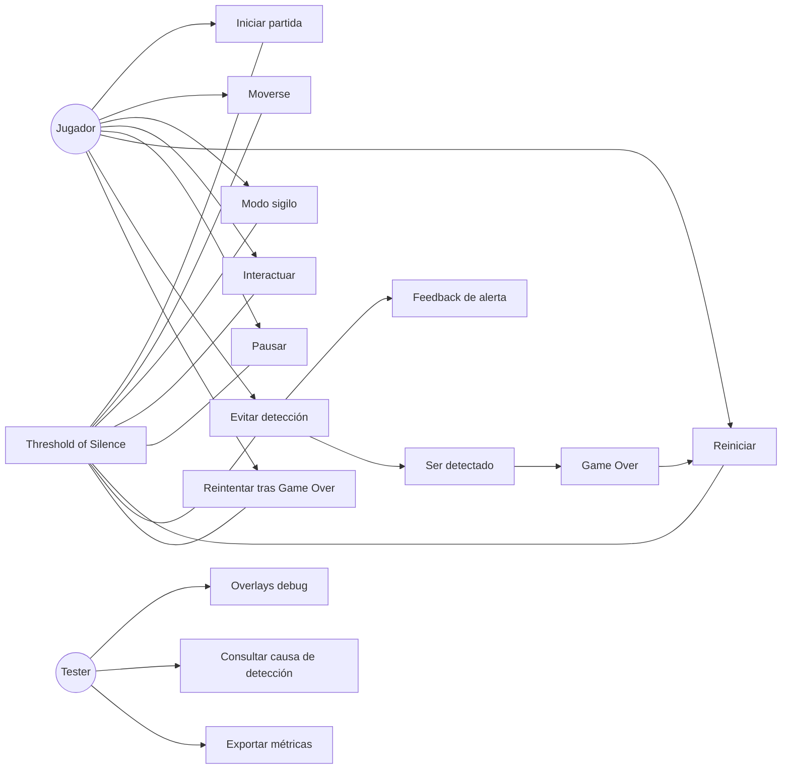
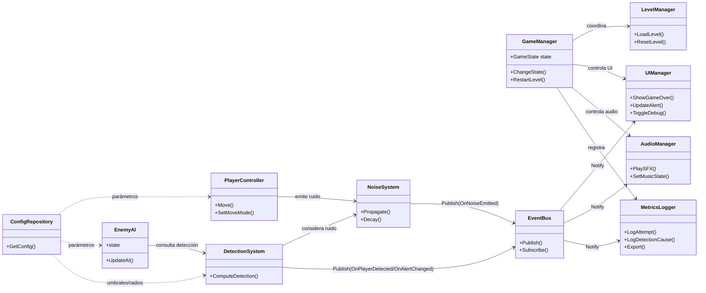
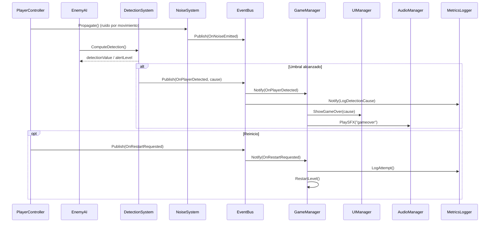
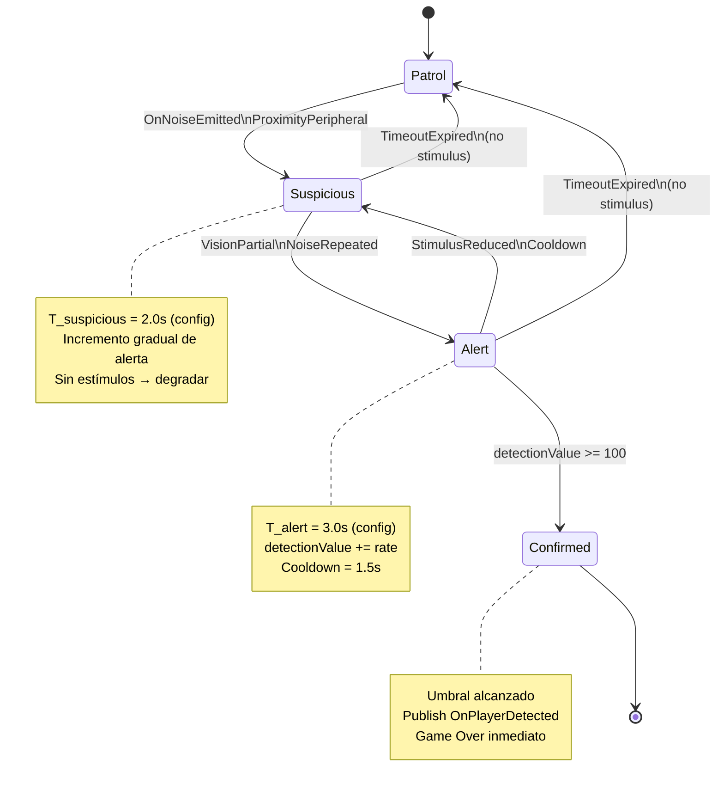
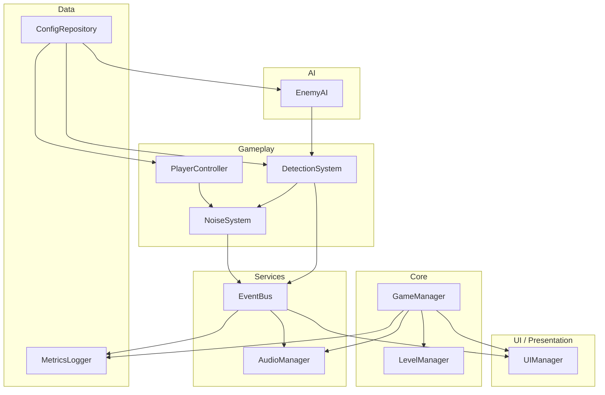

## Arquitectura Técnica — Threshold of Silence:

**Proyecto:** Threshold of Silence (Top-Down 2D / Acción–Sigilo)  

**Objetivo del documento:**  
Definir la arquitectura técnica del proyecto *Threshold of Silence* desde una perspectiva de ingeniería de software, describiendo el diseño de la solución sin entrar en detalles de implementación. El documento establece la estructura lógica del sistema, los diagramas UML principales, los patrones de diseño seleccionados y el stack tecnológico propuesto, garantizando coherencia con el diseño del juego (GDD) y con la planificación del proyecto.

---

## 1. Visión general de la arquitectura

La arquitectura técnica de *Threshold of Silence* se diseña bajo los principios de:

- **Separación de responsabilidades**
- **Modularidad**
- **Bajo acoplamiento y alta cohesión**
- **Diseño orientado a componentes**
- **Configurabilidad sin modificación de código**

El sistema se concibe como un **prototipo jugable (vertical slice)**, por lo que la arquitectura prioriza:
- Claridad y legibilidad del flujo de estados
- Iteración rápida y balanceo de parámetros
- Facilidad de depuración y validación académica

> Nota: Los diagramas y componentes se presentan a nivel conceptual (arquitectura). La implementación concreta se define durante el desarrollo.

---

## 2. Arquitectura lógica del sistema

La solución se organiza en **capas lógicas**, cada una con responsabilidades bien definidas.

### 2.1 Capas de la arquitectura

| Capa | Responsabilidad principal |
|---|---|
| Presentación | Interfaz de usuario, overlays, feedback visual |
| Gameplay | Reglas del juego, movimiento, detección, ruido |
| IA | Comportamiento enemigo y máquinas de estado |
| Core | Gestión de estados globales y flujo del juego |
| Servicios | Audio, eventos, configuración, persistencia |
| Datos | Parámetros, configuraciones y métricas |

---

### 2.2 Módulos principales

| Módulo | Descripción |
|---|---|
| **GameManager** | Controla el estado global del juego y coordina sistemas |
| **LevelManager** | Carga, reinicio y control de niveles |
| **PlayerController** | Movimiento y acciones del jugador |
| **EnemyAI** | Lógica de comportamiento enemigo (FSM) |
| **DetectionSystem** | Detección compuesta: proximidad, visión, ruido, umbrales |
| **NoiseSystem** | Emisión, propagación y decaimiento de ruido |
| **UIManager** | HUD, alertas, pantallas y depuración básica |
| **AudioManager** | Música y efectos de sonido |
| **EventBus** | Publicación y suscripción de eventos (desacople) |
| **ConfigRepository** | Acceso a parámetros configurables (ScriptableObjects/JSON/PlayerPrefs) |
| **MetricsLogger** | Registro de métricas de juego (intentos, causa, tiempos) |

---

## 3. Diagramas UML

### 3.1 Diagrama de Casos de Uso

El diagrama de casos de uso describe las interacciones principales entre el jugador y el sistema.

---

### 3.2 Diagrama de Clases 

---

### 3.3 Diagrama de Secuencia

---
### 3.4 Diagrama de Estados (FSM Enemigo)

---

### 3.5 Componente/Paquetes

---

## 4. Patrones de diseño seleccionados

La arquitectura utiliza patrones de diseño reconocidos, justificados según las necesidades del proyecto.

| Patrón | Componentes / Clases | Problema que resuelve | Justificación técnica |
|------|----------------------|----------------------|----------------------|
| Singleton | GameManager, AudioManager, ConfigRepository | Gestión de estado global único | Una única fuente de verdad para estado del juego, audio y configuración; evita duplicidad entre escenas. |
| State | GameManager, EnemyAI | Complejidad por condicionales | Estados explícitos reducen errores de transición y mejoran legibilidad del flujo (`Playing / Pause / GameOver` + FSM de IA). |
| Observer / Event Bus | EventBus, UIManager, AudioManager, MetricsLogger | Acoplamiento entre sistemas | UI, audio y métricas reaccionan a eventos (detección, ruido, reinicio) sin depender directamente de IA o gameplay. |
| Component (Composition over Inheritance) | VisionSensor, ProximitySensor, NoiseEmitter (conceptual) | Rigidez por herencia profunda | Composición modular de capacidades de detección; permite variantes de enemigos sin jerarquías complejas. |
| Strategy | DetectionSystem | Variación de reglas de detección | Visión, proximidad y ruido como contribuciones configurables; facilita balanceo sin reescribir el sistema. |
| Factory | EnemyFactory, LevelEntityFactory (conceptual) | Creación inconsistente | Estandariza *spawns* y configuración por nivel; reduce errores en diseño de escenas. |

---

## 5. Stack tecnológico propuesto

### 5.1 Motor y lenguaje

| Componente | Tecnología |
|-----------|------------|
| Motor principal | Unity 2D |
| Lenguaje | C# |
| Motor alternativo | Godot Engine |
| Lenguaje alternativo | GDScript |

**Criterio de selección del motor:**  
La elección de Unity 2D se fundamenta en su madurez para prototipos académicos, soporte nativo para sistemas de física y raycasting 2D, y facilidad para implementar arquitecturas orientadas a componentes y máquinas de estado. Godot se considera una alternativa viable por su enfoque open-source y arquitectura basada en nodos, manteniendo equivalencia conceptual.

### 5.2 Backend y persistencia

Para el alcance del prototipo:

- **Backend:** No aplica.
- **Persistencia local:**  
  - Preferencias del usuario: almacenamiento local.  
  - Progreso mínimo: archivo local (JSON).

No se considera una arquitectura cliente-servidor, ya que el proyecto es **single-player** y no contempla servicios en línea.

No se implementa persistencia del estado completo del nivel, enemigos o posiciones dinámicas, dado que el diseño prioriza reinicios rápidos y estados deterministas por intento, alineados con el enfoque de aprendizaje iterativo.

### 5.3 Herramientas complementarias

| Categoría | Herramienta |
|----------|-------------|
| Control de versiones | Git |
| Gestión ágil | GitHub Projects / Trello / Jira |
| Arte 2D | Aseprite / Krita |
| Audio | Audacity |
| Documentación | Markdown |
| Debug / QA | Unity Gizmos / Logs / CSV |

---

## 6. Trazabilidad Técnica (Stack – Módulos – Diagramas)

La siguiente tabla establece la trazabilidad entre el stack tecnológico seleccionado, los módulos definidos en la arquitectura y los diagramas UML que los representan, garantizando coherencia entre diseño conceptual y arquitectura técnica.

| Componente del Stack | Módulos / Sistemas asociados | Diagramas UML relacionados | Propósito arquitectónico |
|---------------------|------------------------------|----------------------------|--------------------------|
| Unity 2D | `GameManager`, `LevelManager` | Clases; Componentes / Paquetes | Orquestación del flujo del juego y ciclo de vida del nivel |
| Unity 2D | `PlayerController` | Clases; Secuencia; Componentes / Paquetes | Movimiento, acciones y emisión de ruido |
| Unity 2D | `EnemyAI` | Clases; FSM Enemigo; Componentes / Paquetes | Comportamiento enemigo basado en estados (FSM) |
| Unity 2D | `DetectionSystem` | Clases; Secuencia; FSM Enemigo | Detección compuesta y escalamiento de alerta |
| Unity 2D | `NoiseSystem` | Clases; Secuencia; Componentes / Paquetes | Propagación y decaimiento del ruido (riesgo indirecto) |
| C# | `EventBus` | Clases; Secuencia; Componentes / Paquetes | Comunicación desacoplada (publicación / suscripción) |
| Unity 2D | `UIManager` | Casos de Uso; Clases; Secuencia; Componentes / Paquetes | Feedback visual, estados de UI y overlays de depuración |
| Unity 2D | `AudioManager` | Clases; Secuencia; Componentes / Paquetes | Música y SFX por estado y eventos |
| JSON / PlayerPrefs / ScriptableObjects | `ConfigRepository` | Clases; Componentes / Paquetes | Configuración y balanceo sin tocar código |
| CSV / JSON local | `MetricsLogger` | Casos de Uso; Clases; Secuencia; Componentes / Paquetes | Instrumentación, evidencias y exportación para evaluación |

---

## 7. Supuestos y Restricciones Arquitectónicas

- El sistema se diseña para ejecución local (single-player).
- No se contempla concurrencia ni sincronización en red.
- El rendimiento se prioriza para prototipo académico, no para producción comercial.
- La arquitectura favorece claridad y trazabilidad sobre optimización extrema.

---

## 8. Conclusión

- La arquitectura propuesta prioriza **modularidad**, **legibilidad** y **trazabilidad** para soportar un prototipo (*vertical slice*) centrado en sigilo determinista y aprendizaje por iteración.
- La incorporación de un **EventBus** formaliza la comunicación desacoplada entre IA y gameplay con las capas de presentación (UI, audio y métricas), mientras que **ConfigRepository** permite un balanceo rápido sin modificar la lógica del sistema.
- Con este enfoque, los **diagramas UML**, las **decisiones tecnológicas** y la **implementación** se mantienen coherentes con el GDD y con la planificación general del proyecto.
